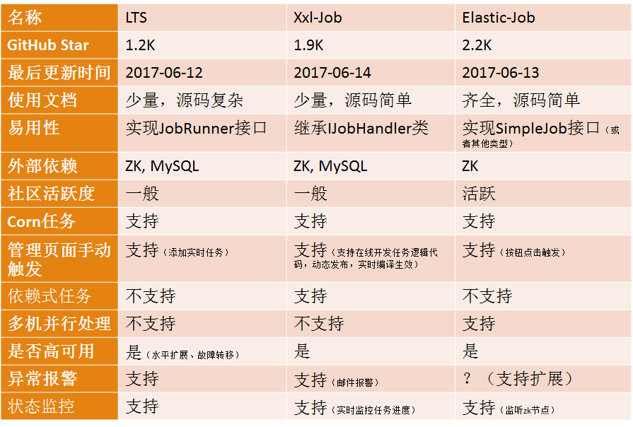

# schedule-job-examples

2020-05-21 >>>>  
elastic-job/LTS 最近更新都是2年前（社区活跃度都不高），issues中还遗留一堆bug未解决...  

elastic-job貌似打算捐献给apache-ShardingSphere 成为其 sub-project，但貌似还木有后续...

1. elastic-job
- [elastic-job-lite]
- [elastic-job-cloud]
- [elastic-job-docs]
- [elastic-job-examples]

[elastic-job-lite]: https://github.com/elasticjob/elastic-job-lite
[elastic-job-cloud]: https://github.com/elasticjob/elastic-job-cloud
[elastic-job-docs]: http://elasticjob.io/index_zh.html
[elastic-job-examples]: https://github.com/elasticjob/elastic-job-example

2. LTS(Light Task Scheduler)
- [LTS]
- [lts-examples]
- [lts-docs]

[LTS]: https://github.com/ltsopensource/light-task-scheduler
[lts-examples]: https://github.com/ltsopensource/lts-examples
[lts-docs]: https://qq254963746.gitbooks.io/lts/content/

3. xxl-job (活跃度较高)
- [xxl-job]: include samples
- [xxl-job-docs]

[xxl-job]: https://github.com/xuxueli/xxl-job
[xxl-job-docs]: https://www.xuxueli.com/xxl-job/

### elastic-job
- [Elastic-Job原理分析（version:2.1.4）](https://www.cnblogs.com/kevin-yuan/p/7017795.html)