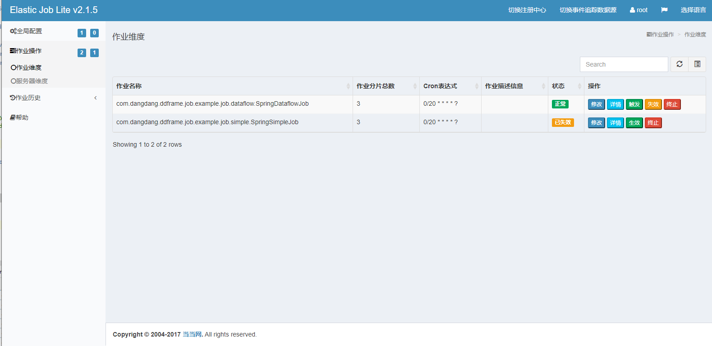

# elastic-job-example

origin: <https://github.com/elasticjob/elastic-job-example>

## origin docs
Elastic-Job 2.x example.

Example for 1.x please see tags in `https://github.com/elasticjob/elastic-job/tree/${tag}/elastic-job-example`

## elastic-job-lite-console
<http://localhost:8899> root/root  

配置注册中心，ex `elastic-job-example-lite-springboot`: 
注册中心名称： <任意>
注册中心地址：localhost:6181  
**命名空间：elastic-job-lite-springboot**

