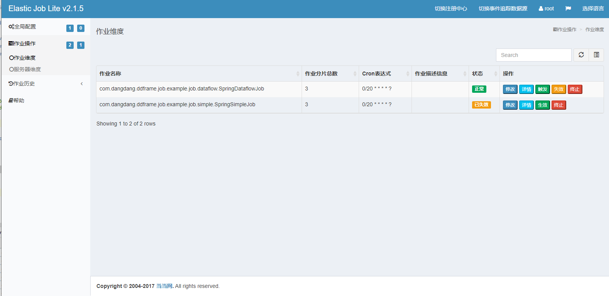

# elastic-job-lite-examples

elastic-job-example: <https://github.com/elasticjob/elastic-job-example>

## origin docs
Elastic-Job 2.x example.

Example for 1.x please see tags in `https://github.com/elasticjob/elastic-job/tree/${tag}/elastic-job-example`

## elastic-job-lite-console
<http://localhost:8899> root/root

配置注册中心，ex `elastic-job-example-lite-springboot`:  
注册中心名称： <任意>  
注册中心地址：localhost:6181  
**命名空间：elastic-job-lite-springboot**

2020-05-21 >>>>
- [(2020-04-21)Discuss about donate Elastic-Job as a subproject of Apache ShardingSphere](https://github.com/elasticjob/elastic-job-lite/issues/728)

1. elastic-job-lite
- [elastic-job-lite]
- [elastic-job-docs]
- [elastic-job-examples]

[elastic-job-lite]: https://github.com/elasticjob/elastic-job-lite
[elastic-job-docs]: http://elasticjob.io/index_zh.html
[elastic-job-examples]: https://github.com/elasticjob/elastic-job-example

## elastic-job
- [Elastic-Job原理分析（version:2.1.4）](https://www.cnblogs.com/kevin-yuan/p/7017795.html)
