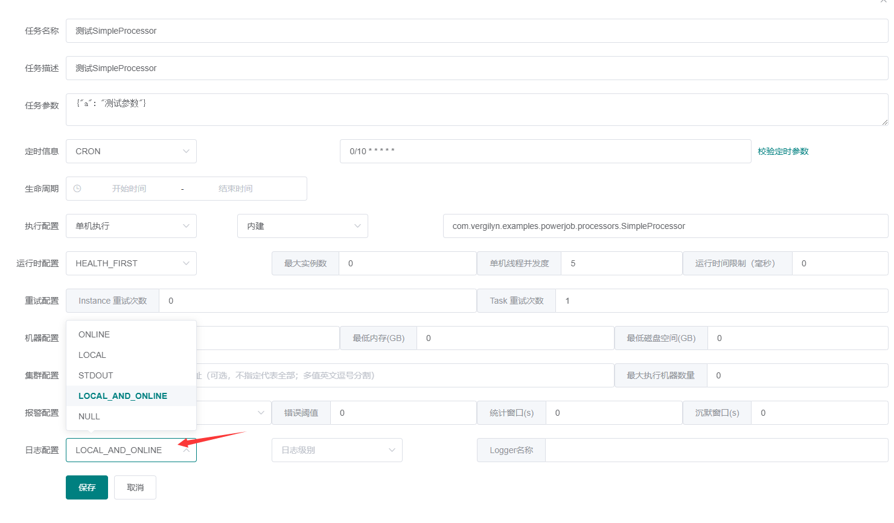

# PowerJob

- Github: <https://github.com/PowerJob/PowerJob>
- official: <www.powerjob.tech/>
- guidance: <https://www.yuque.com/powerjob/guidence>
- 在线体验: <https://www.yuque.com/powerjob/guidence/trial>

[](https://github.com/PowerJob/PowerJob)
[](https://mvnrepository.com/artifact/tech.powerjob/powerjob-worker)
[](https://github.com/PowerJob/PowerJob)

## FAQ

### Q1. powerjob 中的 `任务` 和 `任务实例`
+ powerjob 基本概念（非常重要，请仔细阅读）：<https://www.yuque.com/powerjob/guidence/intro#yKu80>
> 任务（Job）：描述了需要被 PowerJob 调度的任务信息，包括任务名称、调度时间、处理器信息等。
> 
> 任务实例（ JobInstance，简称 Instance）：任务（Job）被调度执行后会生成任务实例（Instance），
> 任务实例记录了任务的运行时信息（任务与任务实例的关系类似于类与对象的关系）。

### Q2. `powerjob: 4.3.2`是否兼容 JDK17?
`powerjob: 4.3.2`发布时间是 `2023-03-19`，支持 JDK17。

### Q3. `任务实例参数 instanceParams` 和 `任务参数 jobParams`

**特别：** `任务管理 - 参数运行` 中填写的参数指的是 `instanceparams`。

所以，如果需要通过 console **手动触发1次**某个任务并且需要指定参数时，在代码编写时需要使用`instanceParams`获取手动触发指定的自定义参数（而不是 `jobParams`）。

### Q4. 通过`OmsLogger`打印的log不会输出到 `*.log`
默认情况下，`taskContext.getOmsLogger -> OmsServerLogger`只会输出到powerjob，方便在console中查看，而不会输出到`*.log`。

解决方式：在创建`任务`时指定日志输出方式（默认 `ONLINE`），例如改成 `LOCAL_AND_ONLINE`


### Q5. 端口使用情况
+ 调度服务器（powerjob-server）配置：<https://www.yuque.com/powerjob/guidence/bdvp1u#4DTFD>
+ 执行器（powerjob-worker）：<https://www.yuque.com/powerjob/guidence/ygonln#m8Yzx>

| port  | side   | remark                                    |
|-------|--------|-------------------------------------------|
| 7700  | server | server端的访问端口，例如 `http://127.0.0.1:7700`   |
| 10086 | server | `oms.akka.port` AKKA协议端口                  |
| 10010 | server | `oms.http.port` HTTP协议端口                  |
| 10010 | server | `oms.http.port` HTTP协议端口                  |
| 27777 | worker | `powerjob.worker.akka-port` akka 工作端口，可选  |

### Q6. `processor` 和 `任务 job` 的关系？
业务开发时，在 worker端编写的都是 `XxxProcessor`，并未指定运行周期 例如 CRON 等。
之后需要在 console 中创建`job`指定任务执行配置 例如 CRON。

**个人：** 
由于之前使用的是 [LTS, light-task-scheduler](https://github.com/ltsopensource/light-task-scheduler) 或者 springboot自带的 `scheduler`，
并未将上述 2步分开。  
而且，从简化业务开发的角度，这2步也几乎是强绑定关系。

目前可行的解决方案：利用 powerjob提供的API，通过编码的方式创建`job`。

但是，在[希望能通过注解自动创建定时任务 #491](https://github.com/PowerJob/PowerJob/issues/491)中作者提到，可以通过 自定义`ProcessorFactory`来实现，  
看了一下相关代码，暂未理解通过此方式如何实现？（还是在 `ProcessorFactory`中去调用 OpenAPI 创建任务？）

**参考：**  
+ [【powerjon-OpenAPI】创建/修改任务](https://www.yuque.com/powerjob/guidence/olgyf0#0c4dccbf)
+ [希望能通过注解自动创建定时任务 #491](https://github.com/PowerJob/PowerJob/issues/491)

### Q6. 表 `job_info`

```sql
-- Data Source: 【docker】MySQL Schema: powerjob-daily Table: job_info  
-- auto-generated definition
CREATE TABLE job_info
(
    id                   bigint AUTO_INCREMENT
        PRIMARY KEY,
    alarm_config         varchar(255) NULL,
    app_id               bigint       NULL,
    concurrency          int          NULL,
    designated_workers   varchar(255) NULL,
    dispatch_strategy    int          NULL,
    execute_type         int          NULL,
    extra                varchar(255) NULL,
    gmt_create           datetime(6)  NULL,
    gmt_modified         datetime(6)  NULL,
    instance_retry_num   int          NULL,
    instance_time_limit  bigint       NULL,
    job_description      varchar(255) NULL,
    job_name             varchar(255) NULL,
    job_params           longtext     NULL,
    lifecycle            varchar(255) NULL,
    log_config           varchar(255) NULL,
    max_instance_num     int          NULL,
    max_worker_count     int          NULL,
    min_cpu_cores        double       NOT NULL,
    min_disk_space       double       NOT NULL,
    min_memory_space     double       NOT NULL,
    next_trigger_time    bigint       NULL,
    notify_user_ids      varchar(255) NULL,
    processor_info       varchar(255) NULL,
    processor_type       int          NULL,
    status               int          NULL,
    tag                  varchar(255) NULL,
    task_retry_num       int          NULL,
    time_expression      varchar(255) NULL,
    time_expression_type int          NULL
);

CREATE INDEX idx01_job_info
    ON job_info (app_id, status, time_expression_type, next_trigger_time);
```

因为需要查询去重后创建`job`，可能需要增加索引。

### Q7. powerjob-server 如何集群部署，以及保证高可用？
只需要 `powerjob-server-01` 和 `powerjob-server-02` 连接到相同的数据库。然后在 worker端 配置 server-address列表。

+ PowerJob 的自实现高可用方案：<https://mp.weixin.qq.com/s/LgJYK8atYUBMCX02EQDP_w>

简单理解就是：  
在worker中配置`powerjob.worker.server-address=127.0.0.1:7700,127.0.0.2:7700`。  
然后将利用 `app-name` 的隔离特性，将相同的 `app-name`的多个 worker实例 交由同一个 server 进行调度。
（其选举过程还是在 server端进行，保存到 表`app_info`，具体参考微信公众号的文章说明）

TODO 2023-04-27，待阅读相关选举的源码。

### Q8. 负载均衡问题

> [负载均衡问题](https://www.yuque.com/powerjob/guidence/problem)  
> + worker 连接 server 默认用 IP 列表的第一个值，<font color="red">多应用接入情况下更换 IP 顺序即可实现各个 server 都提供服务。</font>
> 当然，最推荐的还是用域名的形式做负载均衡。  
> + server 调度 worker 执行任务默认采用的是最优选择策略，单机任务只会选取CPU/内存状态最佳的机器执行！  
> + 当某个节点故障时，PowerJob 有强大的高可用机制进行故障转移，只要系统中有组件存活，调度和任务就能正常进行！  

## 参考
> 浅谈xxl-job和PowerJob两大任务调度框架：<https://www.ithere.net/article/1602958849966600193>
> 总的来说PowerJob在现阶段功能确实是比xxl-job要更为完善。但各自都有不完善的地方

### Q9. 支持仅执行一次吗？
场景：比如期望通过编码的方式，提交1个自定义任务，并在指定的时间执行1次。  
例如 用户下单后30分钟后未支付，取消订单。

> [支持仅执行一次吗？](https://github.com/PowerJob/PowerJob/issues/292)  
> 
> 方式一：CRON表达式支持精确时间调度。  
> 方式二：考虑用 OpenAPI 触发。 (`PowerJobClient#runJob(Long jobId, String instanceParams, long delayMS)`)


### Q10. 清理`任务实例日志`
参考：`tech.powerjob.server.core.scheduler.CleanService#timingClean()`
> SQL: `delete from InstanceInfoDO where gmtModified < ?1 and status in ?2`

备注：
1) 在`powerjob-server`端，通过 `oms.instanceinfo.retention=7` 设置保留天数。  
2) 只会删除状态是`FAILED, 失败`, `SUCCEED, 成功`, `CANCELED, 取消`, `STOPPED, 手动停止`的任务实例日志。  
3) 表`instance_info` 不存在 `gmtModified` 或 `status` 的索引，可能导致 delete 性能偏低。
